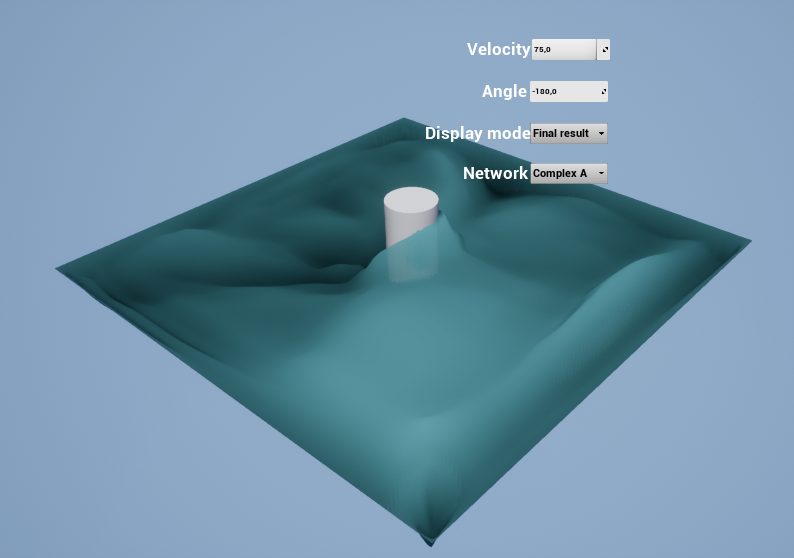

# ueflow
TensorFlow model used to generate a water surface around a moving obstacle in an Unreal Engine 4.

Based on cppflow - https://github.com/serizba/cppflow

Requirements:
CUDNN 8.1
CUDA 11.2

Tensorflow C API libraries are needed. They can be downloaded from:
https://www.tensorflow.org/install/lang_c
And should be placed in:
model2dll/ThirdParty/libtensorflow
As an example, path to tensorflow.dll should like like this:
model2dll\ThirdParty\libtensorflow\lib\tensorflow.dll

Both GPU and CPU versions should work.

Switch to c++ 17
https://gist.github.com/bw2012/069bcb43d0983217dc36f782fc2f1bcc

Also comment lines 942-944:

TF_CAPI_EXPORT extern TF_WhileParams TF_NewWhile(TF_Graph* g, TF_Output* inputs,
                                                 int ninputs,
                                                 TF_Status* status);

in 
tensorflow\c\c_api.h

As unreal treats this warning as an error.

This error prevented everything from working:
https://github.com/serizba/cppflow/issues/87

Work in progress.
